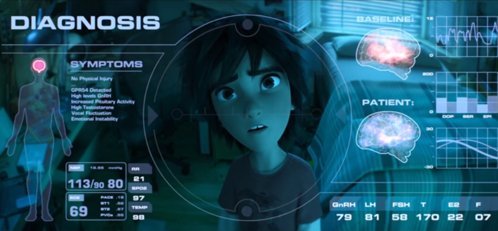
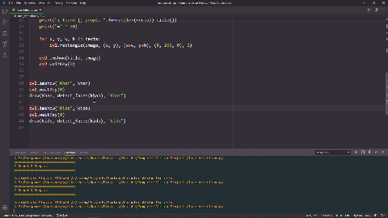

 

#  🤖 Computer Vision Projects Course 🤖

## ⚡ About The Course
### This course is a collection of projects in Computer Vision using OpenCV as applications on [OpenCV for Beginners Course](https://www.youtube.com/playlist?list=PLO1D3YWS7ep3Pfjls3LjBtp5XdvGpBD6Z)

---

<!-- <h2>⚡ Click Any Image Below To Go To The Corresponding Link</h2> -->
## ⚡ Click Any Image Below To Go To The Corresponding Link

### 🌟 The Playlist

### ⭐ Face Detection
---

---
